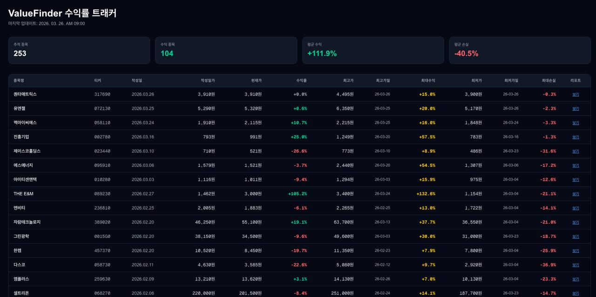

# Korea Research Tracker

**한국 소형주 리서치 리포트 자동 추적 대시보드**

> ValueFinder · 리서치알음 리포트를 자동 크롤링하고, 리포트 작성일 기준 수익률을 매일 업데이트합니다.

🌐 **Live:** [korea-research-tracker.vercel.app](https://korea-research-tracker.vercel.app)



## ✨ 주요 기능

- 📋 **자동 크롤링** — 신규 리포트 감지 및 텔레그램 알림 (ValueFinder + 리서치알음)
- 📈 **수익률 추적** — 리포트 작성일 기준 현재가 대비 수익률 실시간 계산
- 🏆 **최고가/최저가** — 리포트 이후 최대 수익/손실 구간 추적
- 📊 **인터랙티브 차트** — 전망 정확도, 목표가 분석, 시장 반응 등 8종 차트
- 🤖 **완전 자동화** — GitHub Actions로 평일 4시간마다 자동 실행
- 🌐 **웹 대시보드** — Vercel 배포 Next.js 대시보드

## 🏗 지원 소스

| 소스 | 특징 |
|------|------|
| [ValueFinder](https://valuefinder.co.kr) | 국내 유명 기업분석 리포트 커뮤니티 |
| [리서치알음](https://www.researcharum.com) | 소형주 전문 리서치, 전망(Positive/Neutral/Negative) + 적정주가 제공 |

## 🏗 아키텍처

- **DB 없음** — `data/*.json` 하나로 모든 상태 관리 (Git as Database)
- **Mac 불필요** — GitHub Actions 서버에서 완전 독립 실행
- **ScraperAPI** — 한국 IP 우회 크롤링

## 🚀 배포 방법

### 1. 레포지토리 Fork

```bash
git clone https://github.com/dragon1086/korea-research-tracker.git
cd korea-research-tracker
```

### 2. GitHub Secrets 등록

레포 → Settings → Secrets and variables → Actions → New repository secret

| Secret | 설명 |
|--------|------|
| `TELEGRAM_BOT_TOKEN` | 텔레그램 봇 토큰 (BotFather에서 발급) |
| `TELEGRAM_CHAT_ID` | 알림 받을 텔레그램 chat_id |
| `SCRAPER_API_KEY` | [ScraperAPI](https://scraperapi.com) API 키 (무료 1,000 크레딧/월) |

### 3. Vercel 배포

1. [vercel.com](https://vercel.com) → New Project
2. 이 레포 선택
3. **Root Directory: `web`** 설정
4. Deploy

### 4. GitHub Actions 수동 테스트

레포 → Actions → `Update ValueFinder Data` → Run workflow

## 💻 로컬 실행

```bash
# Python 의존성 설치
pip install -r requirements.txt

# .env.local 생성 후 토큰 입력
cp .env.local.example .env.local

# 크롤러 실행
python tracker.py
python tracker_researcharum.py

# 웹 개발 서버
cd web
npm install
npm run dev
```

## 📦 기술 스택

| 역할 | 기술 |
|------|------|
| 크롤링 | Python + BeautifulSoup + ScraperAPI |
| 주가 데이터 | [FinanceDataReader](https://github.com/FinanceData/FinanceDataReader) (KRX) |
| 자동화 | GitHub Actions |
| 프론트엔드 | Next.js 16 + Tailwind CSS + Recharts |
| 배포 | Vercel |
| 알림 | Telegram Bot API |

## 📄 라이선스

[MIT License](LICENSE)
